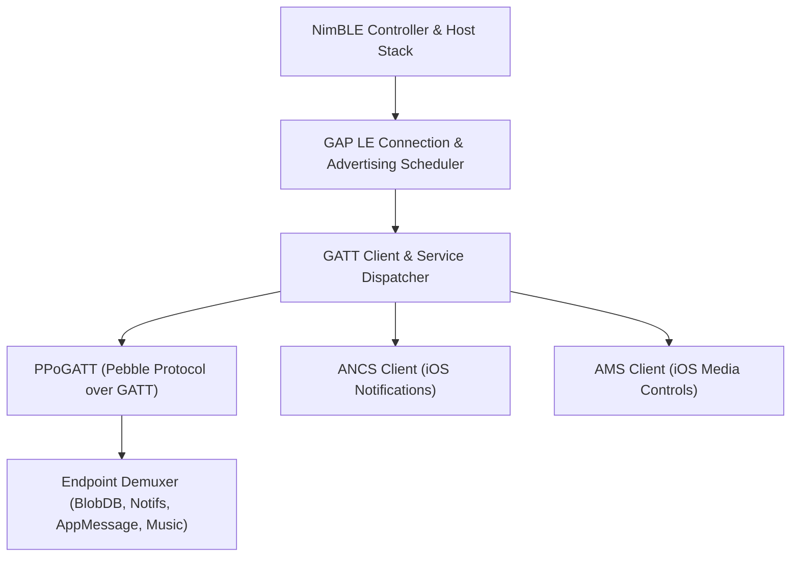

# PebbleOS Codebase & Architecture Guide

A comprehensive technical guide for developers and AI agents working on **PebbleOS**, the open-source FreeRTOS-based operating system powering Pebble and Core Devices smartwatches.

---

## 1. System Philosophy & Architecture Overview

PebbleOS is an ultra-low-power, event-driven embedded operating system designed specifically for wearable devices. Originally developed by Pebble Technology and maintained by Core Devices, it is optimized for:
- **Extreme energy efficiency**: Days-to-weeks of battery life via aggressive MCU sleep states, low-power display modes, and timer coalescing.
- **Memory-in-Pixel (MIP) displays**: Sunlight-readable reflective color and monochrome LCDs that require no backlight in ambient light and refresh only modified pixel regions.
- **Deterministic memory footprints**: Fixed statically partitioned RAM arenas for kernel, apps, and background workers with hardware MPU protection.
- **Asynchronous, event-driven communication**: Non-blocking message passing between FreeRTOS tasks and phone companions over Bluetooth Low Energy (BLE).

### Platform & Display Matrix
| Board / Platform | Display Tech | Resolution | Color Depth | Content Size | Typical Device |
| :--- | :--- | :--- | :--- | :--- | :--- |
| `aplite` | MIP B&W | 144 &times; 168 | 1-bit Monochrome | Medium | Pebble Classic / Steel |
| `basalt` | MIP Color | 144 &times; 168 | 64 Colors (8-bit 2:2:2) | Medium | Pebble Time / Time Steel |
| `chalk` / `gabbro` | MIP Color Round | 180 &times; 180 | 64 Colors (8-bit 2:2:2) | Medium | Pebble Time Round |
| `flint` / `asterix` | MIP B&W Hi-Res | 144 &times; 168 | 1-bit Monochrome | Medium | Pebble 2 SE / HR |
| `emery` / `obelix` | MIP Color Hi-Res | 200 &times; 228 | 64 Colors (8-bit 2:2:2) | Large / ExtraLarge | Pebble Time 2 |

---

## 2. Repository Organization

```text
PebbleOS/
├── apps/                 # External userland app templates and system apps
├── boards/               # Hardware board configurations and manifests (obelix, asterix, qemu_*)
├── cmake/                # CMake modules, toolchain scripts, and generators
├── docs/                 # Sphinx / ReadTheDocs documentation
├── include/pbl/          # Public subsystem & service interface headers
│   ├── drivers/          # Hardware driver interfaces (battery, accel, hrm, flash, etc.)
│   ├── logging/          # Log macros and dehashing interfaces
│   └── services/         # OS services (bluetooth, notifications, timeline, blob_db, etc.)
├── resources/            # Firmware resources (system fonts, icons, bitmaps, audio, i18n catalogs)
├── sdk/                  # Pebble SDK headers and export machinery
├── soc/                  # Vendor HAL & SoC support code (STM32, Nordic, etc.)
├── src/
│   ├── bluetooth-fw/     # BLE controller/HCI drivers & NimBLE adaptation
│   └── fw/               # Core Firmware Source Tree
│       ├── applib/       # Userland app framework, graphics, and UI layers
│       ├── apps/         # Built-in system applications (Settings, Notifications, Music, Workout)
│       ├── comm/         # Phone communication, BLE GAP/GATT, and protocol endpoints
│       ├── drivers/      # Low-level hardware drivers (display, flash, buttons, power, vibe)
│       ├── kernel/       # FreeRTOS tasks, event loop, memory allocators, core dumps
│       ├── popups/       # System modal overlays (notification pop-up window, alerts)
│       ├── process_management/ # App loader, install manager, process lifecycles
│       ├── services/     # System background services (blob_db, notifications, timeline, pfs)
│       ├── shell/        # System shell, watchface switcher, system theme
│       └── syscall/      # MPU privilege escalation and kernel syscall boundary
├── subsys/               # Shared OS subsystems (logging, etc.)
├── tests/                # Unit test suite (330+ tests, stubs, and fakes)
├── third_party/          # Submodules (FreeRTOS, NimBLE, Moddable, picolibc)
└── tools/                # Build system helpers, resource compilers, and pbl CLI
    └── libs/pbl-cli/     # 'pbl' command-line interface implementation
```

---

## 3. Developer Tooling & The `pbl` CLI

All firmware configuration, compilation, testing, emulation, and packaging are driven by the unified `pbl` CLI (located in `tools/libs/pbl-cli` and installed into the Python virtual environment `.venv`).

### Essential Workflow Commands

```bash
# 1. Configure the build directory for a specific hardware board or QEMU target
.venv/bin/pbl configure --board=obelix@pvt -DCONFIG_FIRMWARE_SLOT=0

# Configuration flags:
#   --board BOARD_NAME      Target board (e.g. obelix@pvt, asterix, qemu_emery, qemu_flint)
#   -DCONFIG_FIRMWARE_SLOT  Dual-slot image target (0 or 1)
#   -DCONFIG_RELEASE=y      Build in release mode (optimizations, disables dev assertions)
#   -DCONFIG_MFG=y          Build manufacturing test firmware
#   --variant=normal|prf    Select build variant (normal firmware or Pebble Recovery Firmware)

# 2. Build the firmware binary
.venv/bin/pbl build

# 3. Package the firmware into a distributable .pbz bundle
.venv/bin/pbl bundle
# Writes: build/normal_<board>_v<version>_slot<slot>.pbz

# 4. Run the entire unit test suite (runs under ctest)
.venv/bin/pbl test

# 5. Launch interactive QEMU emulator
.venv/bin/pbl qemu

# 6. Emulation utilities (capture screen, inject touch or button input)
.venv/bin/pbl screenshot output.png
.venv/bin/pbl touch 100 114
.venv/bin/pbl swipe up
```

### Dual-Slot Architecture
Pebble smartwatches employ an A/B dual-slot firmware scheme (`Slot 0` and `Slot 1`) in external SPI NOR flash. The bootloader selects and executes the active slot based on metadata flags in `FirmwareSlotHeader`. When testing or sideloading releases, always build both `slot0` and `slot1` bundles.

---

## 4. Kernel, Tasks & Asynchronous Event Model

PebbleOS runs atop **FreeRTOS** with a fixed set of preemptive tasks defined in [`src/fw/kernel/pebble_tasks.h`](file:///Users/mwarren/projects/PebbleOS/src/fw/kernel/pebble_tasks.h):

```c
typedef enum PebbleTask {
  PebbleTask_KernelMain,        // System bringup, shell, window stack, system apps
  PebbleTask_KernelBackground,  // Heavy filesystem I/O, crypto, background storage
  PebbleTask_Worker,            // Background worker process for apps
  PebbleTask_App,               // Currently active foreground application
  PebbleTask_BTHost,            // Bluetooth host stack (NimBLE host)
  PebbleTask_BTController,      // Low-level BLE controller execution
  PebbleTask_BTHCI,             // HCI transport packet pump
  PebbleTask_NewTimers,         // Timer queue task
  PebbleTask_PULSE,             // Voice/audio processing pipeline
  NumPebbleTask,
} PebbleTask;
```

### Inter-Task Communication (`PebbleEvent`)
Tasks avoid blocking cross-task calls. Instead, state changes and asynchronous operations post events via the kernel event queue:
```c
PebbleEvent event = {
  .type = PEBBLE_BT_CONNECTION_EVENT,
  .bluetooth = {
    .connection_status = BluetoothStatusConnected,
  },
};
event_put(&event);
```
Tasks consume events in their main loop via `event_service` and route them to interested handlers (e.g. `PEBBLE_SYS_NOTIFICATION_EVENT`, `PEBBLE_BUTTON_DOWN_EVENT`, `PEBBLE_TICK_EVENT`).

### Privilege Boundary & Syscalls
- **Hardware Protection**: Cortex-M MPU isolates the kernel from userland apps and workers.
- **Syscall Raising**: Any applib call that mutates OS state crosses through `DEFINE_SYSCALL` in [`src/fw/syscall/syscall_internal.h`](file:///Users/mwarren/projects/PebbleOS/src/fw/syscall/syscall_internal.h).
- Calling a `sys_*` function executes an `svc 2` exception, which elevates MCU execution to privileged mode, executes `__funcName`, validates userspace pointer buffers using `syscall_assert_userspace_buffer()`, and drops privilege on exit.

---

## 5. Bluetooth Architecture & Multi-Phone Routing

The communication subsystem ([`src/fw/comm/ble/`](file:///Users/mwarren/projects/PebbleOS/src/fw/comm/ble/)) is one of the most sophisticated areas of PebbleOS.



### Key BLE Components
1. **Connection Virtualization (`gap_le_connect.c`, `gap_le_connection.c`)**:
   - Manages BLE connections via "Connection Intents". Multiple kernel clients request connectivity without directly controlling physical GAP links.
   - Handles IRK (Identity Resolving Key) resolution to track remotes using BLE private resolvable addresses.
2. **Advertising Scheduler (`gap_le_advert.c`)**:
   - Hardware BLE controllers can often only advertise one payload at a time. PebbleOS uses a round-robin time-slicing scheduler to cycle through discoverable and reconnect advertising jobs.
3. **Pebble Protocol (PP) & Endpoints**:
   - Data over BLE is framed using COBS (Consistent Overhead Byte Stuffing) and routed to discrete 16-bit endpoints:
     - `0x0030` (BlobDB sync)
     - `0x0031` (Notifications)
     - `0x0032` (AppMessage)
     - `0x0011` (DataLogging)
     - `0x0010` (Time/Status)

### Multi-Phone (BLE-Multi) Routing Architecture
Recent firmware supports multi-phone connectivity:
- **Pairing Indices vs. Connections**:
  - `idx = 0`: Phone 1 (primary).
  - `idx = 1`: Phone 2 (secondary).
  - Remotes in `Settings -> Bluetooth` are ordered strictly by BLE pairing index via `remote_comparator` in [`bluetooth.c`](file:///Users/mwarren/projects/PebbleOS/src/fw/apps/system/settings/bluetooth.c).
- **Timeline Flag Attribution**:
  - `CommonTimelineItemHeader.flags` dedicates a 1-bit field:
    ```c
    uint8_t phone_idx:1; // 0 = Phone 1, 1 = Phone 2
    ```
- **Dynamic Indicator Suppression**:
  - When only one phone is currently connected, multi-phone indicators are suppressed across the OS (`notifications_are_multi_phone_indicators_enabled()`) to avoid visual noise.

---

## 6. Notification & Timeline Subsystem

Notifications enter PebbleOS through two pipelines:
1. **iOS**: Apple Notification Center Service (ANCS) client ([`src/fw/comm/ble/kernel_le_client/ancs/`](file:///Users/mwarren/projects/PebbleOS/src/fw/comm/ble/kernel_le_client/ancs/)).
2. **Android**: Pebble Protocol notification endpoint over PPoGATT.

Both pipelines deserialize the notification into a canonical `TimelineItem` and write it to BlobDB (`notif_db.c`).

### Notification Presentation Hierarchy
```text
Incoming Notification
        │
        ▼
[BlobDB: notif_db.c]  ──►  Post PEBBLE_SYS_NOTIFICATION_EVENT
                                    │
       ┌────────────────────────────┴───────────────────────────┐
       ▼                                                        ▼
[Modal Pop-up Window]                                  [Notifications App]
(popups/notifications/notification_window.c)           (apps/system/notifications.c)
 - Banner slide-in animation                            - Historical notification list
 - Settled card view                                    - App icon + unread status
 - "M/N" pagination for message bursts                  - Actionable dialogs (Dismiss,
 - Option C corner pips (1 dot / 2 dots)                  Reply, Open on Phone)
```

### Visual Indicator Design (Zero-Text Indicators)
To conserve precious display space, `(1) ` and `(2) ` text prefixes were eliminated in favor of clean geometric pips:
- **Phone 1**: Single vertical pip / dot (`.`).
- **Phone 2**: Two vertical pips / dots (`:`).
- **Notification Pop-up**: Rendered in the top-right corner of the banner using `gcolor_legible_over(colors->bg_color)` matching the header clock.
- **Notification List**: Rendered in the left margin alongside the app icon.
- **Settings &rarr; Bluetooth**: Rendered as the first character on the left side of the "Connected" subtitle line.

---

## 7. UI Framework, Typography & Graphics Gotchas

PebbleOS UI (`applib/ui/`) is structured around a hierarchy of `WindowStack` &rarr; `Window` &rarr; `Layer` &rarr; custom sublayers.

```text
WindowStack
  └── Window (e.g. Settings Menu)
        ├── Root Layer (full screen bounds)
        │     └── MenuLayer / ScrollLayer
        │           ├── MenuCellLayer (row 0: "Pixel 8", "Connected")
        │           └── MenuCellLayer (row 1: "iPhone", "Connected")
        └── StatusBarLayer (optional top battery/clock bar)
```

### Critical Font Sizing & Alignment Gotchas

#### 1. System Themes vs. Default Font Sizing
When drawing custom content inside system applications (like `Settings`):
- **DO NOT** use `system_theme_get_font_for_default_size(...)`. That function returns the platform default fallback (e.g. `GOTHIC_18`), ignoring dynamic content sizing tiers.
- **DO USE** `system_theme_get_font(TextStyleFont_MenuCellTitle)` and `system_theme_get_font(TextStyleFont_MenuCellSubtitle)`. System apps bypass default fallbacks (`prv_use_platform_default_size()` evaluates to `false`), matching `menu_cell_basic_draw` across high-res displays (`GOTHIC_24` on Emery/Obelix).

#### 2. Glyph Baseline Centering Geometry
Pebble's Gothic fonts sit on a baseline near the bottom of their bounding box, with internal font ascent padding above.
- Simply computing `y = box.origin.y + (box.size.h / 2)` centers elements relative to the **bounding box**, not the **glyphs**, causing visual elements to float 5–6 pixels too high relative to adjacent text.
- To align graphical pips/dots dead-center with the text glyphs across any font size:
  ```c
  const int16_t pip_cy = sub_box.origin.y + subtitle_height - (subtitle_height * 7 / 24);
  ```
  *(On 24px Emery fonts, this positions the vertical center at $+17\text{px}$ from origin; on 18px Basalt fonts, at $+13\text{px}$, perfectly matching the cap/x-height).*

---

## 8. Storage, BlobDB & File System (PFS)

PebbleOS avoids raw, unmanaged flash writes. It uses two storage layers:
1. **PFS (Pebble File System)** ([`src/fw/services/filesystem/pfs.c`](file:///Users/mwarren/projects/PebbleOS/src/fw/services/filesystem/pfs.c)):
   - A wear-leveling log-structured filesystem designed for NOR flash.
   - Allocates pages round-robin, tracking the last written page index to distribute write cycles evenly across physical flash blocks.
2. **BlobDB** ([`src/fw/services/blob_db/`](file:///Users/mwarren/projects/PebbleOS/src/fw/services/blob_db/)):
   - Key-value databases backed by PFS files.
   - Synchronized bidirectionally with the phone companion over endpoint `0x0030`:
     - `pin_db`: Timeline pins and reminders.
     - `notif_db`: Stored notifications.
     - `appglance_db`: Glance summaries for launcher icons.
     - `reminder_db`: Calendar and agenda alarms.

---

## 9. Logging & Log Dehashing Subsystem

To minimize flash usage and serial bandwidth, format strings are **not** stored as raw ASCII strings inside the firmware ELF.
- **Compile-time Hashing**: The resource compiler hashes all format strings in `PBL_LOG_*` into 32-bit integer hashes, producing `build/src/fw/loghash_dict.json`.
- **Target Emission**: The watch firmware outputs only the 32-bit hash and binary arguments over UART.
- **Host Dehashing**: The `pbl console` and QEMU drivers look up the hash in `loghash_dict.json` and reconstruct the human-readable message on your terminal in real time.

### Logging Rules
- Use `PBL_LOG_WRN` and `PBL_LOG_ERR` for genuine warnings and errors.
- Default to `PBL_LOG_DBG` for lifecycle traces and state transitions.
- **Strict Prohibition**: Do **not** log at `PBL_LOG_INFO` in code paths that fire repeatedly under normal use (e.g. animation frames, scroll events, BLE packet polls). Reserve `PBL_LOG_INFO` exclusively for significant, infrequent lifecycle milestones.

---

## 10. Code Style & Git Contribution Rules

All commits in this repository must satisfy strict project standards enforced by automated CI (`gitlint`, `clang-format`, and `ruff`).

### 1. Git Commit Message Conventions
- **Header Format**: `area: short imperative description` (e.g., `ui/settings: center indicator dots with connected text`).
- **Sign-off**: Always commit with `git commit -s` to include `Signed-off-by: Your Name <email>`.
- **AI Co-Authorship**: Every commit created with or assisted by an AI model must include:
  ```text
  Co-Authored-By: <Model Name> <noreply@google.com>
  ```
- **Bisectability**: Commit in logical, self-contained chunks that compile and pass tests independently.
- **Issue References**: Reference GitHub or Linear issues in the commit body (`Fixes #123`), **never** in source code comments.

### 2. Code Formatting
- **C Code**: Adheres to Google / LLVM C style via `.clang-format`.
- **Python Code**: Checked and formatted via `ruff` (`.ruff.toml`).
- **Comments**: Keep comments short, focused on non-obvious rationale and hardware quirks. Defer long design essays to commit messages or `docs/`.

---

## Quick Reference Summary

| Need | Where to look / What to run |
| :--- | :--- |
| **Configure for hardware** | `.venv/bin/pbl configure --board=obelix@pvt -DCONFIG_FIRMWARE_SLOT=0` |
| **Build & Bundle** | `.venv/bin/pbl build && .venv/bin/pbl bundle` |
| **Run Unit Tests** | `.venv/bin/pbl test` (332 tests under ctest) |
| **Emulator & Screen** | `.venv/bin/pbl qemu`, `.venv/bin/pbl screenshot <file.png>` |
| **FreeRTOS Tasks** | [`src/fw/kernel/pebble_tasks.h`](file:///Users/mwarren/projects/PebbleOS/src/fw/kernel/pebble_tasks.h) |
| **BLE Stack** | [`src/fw/comm/ble/`](file:///Users/mwarren/projects/PebbleOS/src/fw/comm/ble/) |
| **Notifications** | [`src/fw/popups/notifications/`](file:///Users/mwarren/projects/PebbleOS/src/fw/popups/notifications/), [`src/fw/apps/system/notifications.c`](file:///Users/mwarren/projects/PebbleOS/src/fw/apps/system/notifications.c) |
| **Settings Menus** | [`src/fw/apps/system/settings/`](file:///Users/mwarren/projects/PebbleOS/src/fw/apps/system/settings/) |
| **Storage / BlobDB** | [`src/fw/services/blob_db/`](file:///Users/mwarren/projects/PebbleOS/src/fw/services/blob_db/), [`src/fw/services/filesystem/pfs.c`](file:///Users/mwarren/projects/PebbleOS/src/fw/services/filesystem/pfs.c) |
